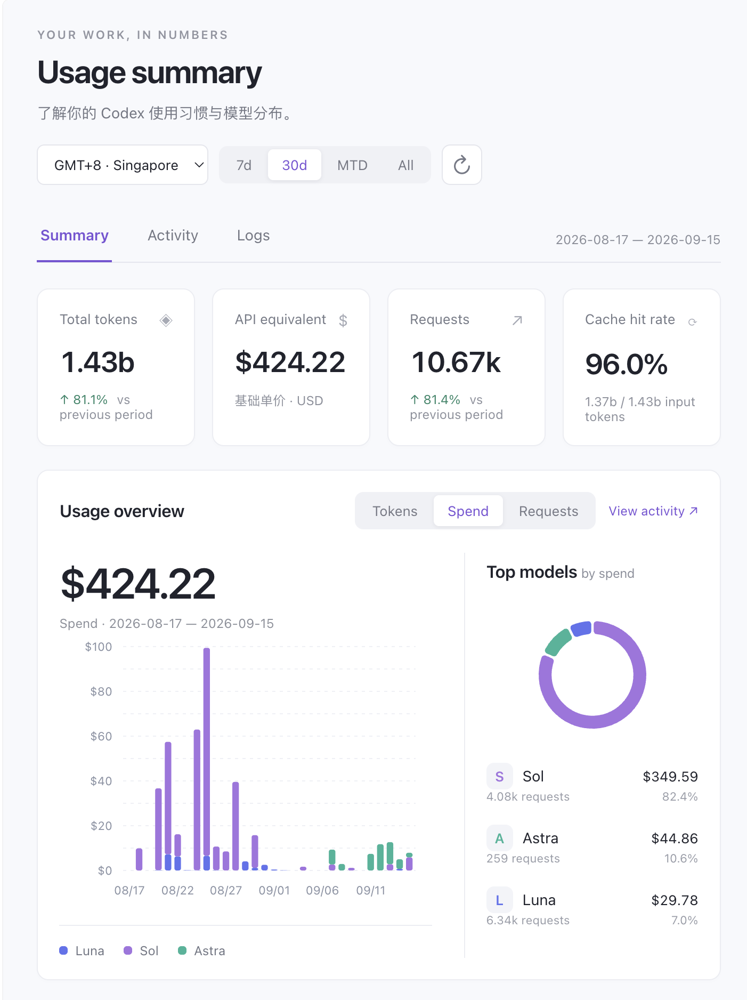

# Codex Usage — 本地使用分析

读取真实的 `~/.codex/sessions/**/rollout-*.jsonl`，没有演示数据、云服务、远程字体、CDN、遥测或外部 API 调用。



## 启动

需要 Python 3.9 或更新版本（含系统时区数据库；macOS 通常已有）。**不需要 npm install 或 pip install。**

在项目目录运行：

```sh
python3 server.py
```

打开 <http://127.0.0.1:8765>。按 `Ctrl+C` 停止服务。


如果 8765 端口已经被占用（例如本次预览仍在运行），直接打开现有页面，或指定其他端口：

```sh
python3 server.py --port 8766
```

自定义日志与缓存目录：

```sh
python3 server.py --sessions /absolute/path/to/sessions --cache /absolute/path/to/usage.sqlite3
```

只监听 `127.0.0.1`，不开放局域网访问。页面不是可直接双击使用的静态文件，需启动本地服务以读取日志。

## 功能

- **Summary**：总 tokens、基础单价 API 等效、请求数、缓存命中率，按模型份额、日均 / 周均、活跃天数、最长连续使用天数。
- **Logs**：访问 `/logs` 逐条查看精确请求时间、模型、input / cached / uncached / output / reasoning / total tokens、cache hit 与 6 位小数的 API 等效花费。支持模型筛选、25 / 50 / 100 条分页；点击请求时间展开费用拆分、来源日志文件名、字节位置和事件 ID。上方趋势图与时间、模型筛选一致。
- **Activity**：按日、按模型堆叠图，Tokens / Spend / Requests 切换，花费趋势、请求量、token breakdown、prompt caching、日历热力图。超过 90 天的趋势图自动汇总为连续 7 天的周区间；热力图和 Logs 仍保留逐日 / 逐条明细。
- **筛选**：7d、30d、90d、MTD、All、Custom range…（选择起止日期，包含两端）；默认 GMT+8，可切换 UTC、洛杉矶、伦敦。自定义日期写入页面地址，刷新或切换页面后仍保留。
- **明细**：Luna / Sol / Astra 及所有实际出现的其他模型；准确数值通过悬停或 CSV 导出查看。
- **热力图**：至少展示最近一年作为上下文；所选范围外降低颜色强度，上方统计仅计算所选范围。
- **刷新**：右上角刷新会增量扫描。切换范围也会检查日志变化（5 秒内复用扫描结果）。页面不会在后台自动轮询。

## 统计口径

1. `input_tokens` 已包含 `cached_input_tokens`。`uncached_input_tokens = input_tokens - cached_input_tokens`。
2. `output_tokens` 已包含 `reasoning_output_tokens`。总 token = input + output，不能再次加上 cached 或 reasoning。
3. 优先采用有效 token_count 事件的 `last_token_usage`，缺失时使用累计计数的差值。计数回退视为重置。
4. 相同文件重复报告相同累计用量时，不再增加请求数。`info: null` 的配额事件不计入。
5. 跨文件相同时间戳、模型、累计计数与本次用量的事件会去重，处理常见的 fork 历史复制。此规则是日志级启发式；日志没有稳定的 API request ID 时，不能保证与服务端计费事件一一对应。
6. 模型根据事件的显式模型或此前 `turn_context.model` 归属；`gpt-5.6` 映射到 Sol。`gpt-reserve` 汇总归入 Luna；`gpt-5.3-codex-spark` 汇总归入 GPT-5.3-Codex；`codex-auto-review` 在 2026-07-31 01:17:10（GMT+8）前汇总归入 5.4 Mini，之后归入 Luna。Logs 保留原始模型名并显示计价模型。未知模型保留原始名称，未发现模型归属的事件使用 `unknown`。
7. **Requests 指去重后的用量事件数**，不是用户消息数、tool call 数或可核对的服务端账单请求数；未写入本地日志的用量无法恢复。
8. 日界按选定时区计算。7d / 30d / 90d 包含今天；MTD 为本月至今；All 为首个有用量的日期至今天；Custom range 包含所选起止日期。日均含空白日，周均 = 日均 × 7。最长 streak 在所选范围内计算。
9. 与前一时段比较时，使用紧邻所选范围之前、相同自然日天数的时段；今天可能尚未结束。All 不做前期比较。
10. 当前仅读取传入的 sessions 目录；其他机器、其他账号、已移出此目录的 archived_sessions 不会自动合并。历史已删除日志不可能被恢复。

## API 等效价格

价格文件是 `pricing.json`，美元 / 百万 token；修改后刷新页面即可生效，不需要重建缓存。

| 模型 | Uncached input | Cached input | Cache write | Output |
|---|---:|---:|---:|---:|
| GPT-5 / 5.1 | $1.25 | $0.125 | — | $10.00 |
| GPT-5.2 / 5.3-Codex | $1.75 | $0.175 | — | $14.00 |
| GPT-6 Luna | $0.10 | $0.01 | $0.125 | $0.50 |
| GPT-6 Sol | $2.00 | $0.20 | $2.50 | $10.00 |
| GPT-6 Astra | $10.00 | $1.00 | $12.50 | $50.00 |

核对于 **2026-09-23**：[GPT-5](https://developers.openai.com/api/docs/models/gpt-5)、[GPT-5.1](https://developers.openai.com/api/docs/models/gpt-5.1)、[GPT-5.2](https://developers.openai.com/api/docs/models/gpt-5.2)、[GPT-5.3-Codex](https://developers.openai.com/api/docs/models/gpt-5.3-codex)、[GPT-6 Luna](https://developers.openai.com/api/docs/models/gpt-6-luna)、[GPT-6 Sol](https://developers.openai.com/api/docs/models/gpt-6-sol)、[GPT-6 Astra](https://developers.openai.com/api/docs/models/gpt-6-astra)。另已配置 GPT-5/5.1/5.2 的 Codex 变体，其中 5.1-Codex Mini 使用其独立单价。所有已配置模型的官方链接也在网站底部的“统计口径与价格依据”中。

这是**当前标准基础单价的 API 等效估算，非实际付款金额**。不包含 >272K 长上下文加价、服务等级、工具调用、地区加价、历史价格变化。公开文档给出的长上下文定价和日志中的 session 概念不能简单等同，所以本项目选择明确的基础单价口径，而不声称精确还原 API 账单。

公式：

```text
((uncached_input - cache_write) × input_rate
 + cache_write × write_rate
 + cached_input × cached_rate
 + output × output_rate) / 1,000,000
```

Cache writes 视为未缓存输入中的子集；未配置写入单价时使用 input 单价。Reasoning 包含在 output 中，不额外计费。


## 增量扫描与隐私

- Python 按行读取，SQLite 持久化每个文件的 inode、mtime、size、已读字节位置、模型/累计计数状态。
- 未变动文件不重新读取；追加文件从上次位置继续，并校验追加边界前 512 字节。
- 截断、替换、同长度改写会重扫该文件；删除文件时移除其缓存记录。若其他文件仍保留同一重复事件，其用量仍被保留。
- 没写完的最后一行留到下次追加后处理。格式错误的用量 / 元数据行跳过并计数，文件读取错误在页面提示。
- 普通追加式 rollout 是优化目标；“前面内容被修改并同时在末尾追加，但最后 512 字节边界不变”无法由轻量检查识别。此类人工改写后，请停止服务、删除项目 `.cache/` 再启动以完整重建。
- 默认缓存存于项目 `.cache/usage.sqlite3`，只含时间、模型、用量、哈希和本地路径 / 扫描状态，不保存提示词、回答或工具输出。Summary / Activity 只接收聚合结果；Logs 按页接收请求用量和来源文件名 / 字节位置，不接收对话内容。
- 同一时区、时间范围与价格设置的汇总结果会在服务进程内复用；日志新增、替换或删除，以及价格文件内容修改后会重新计算。长范围图表自动做周汇总，减少 Nivo 需要绘制的图形数量。
- 不修改原始日志，不上传日志。价格链接只有用户主动点击时才访问外网。

## 文件结构

```text
server.py           本地 HTTP 服务，显式静态资源白名单
analytics.py        JSONL 增量索引、去重、聚合
pricing.json        可编辑的单价和价格说明
dist/index.html     页面入口
src/app.js          页面交互、CSV 导出
src/charts.jsx      React + Nivo 图表组件
dist/app.js         已打包、可直接运行的前端文件
dist/style.css      响应式卡片布局
tests/              解析统计测试
.cache/             首次运行生成，未打入交付压缩包
```

运行时采用已打包的 React + Nivo 图表，以及 Python 标准库 / SQLite。正常使用没有安装或构建步骤；修改 `src/` 后才需要重新构建前端。

## 验证

```sh
python3 -m unittest discover -s tests -v
```

覆盖：重复累计事件、复制的 fork 历史、增量扫描、尾部不完整行、重启续扫、模型切换、计数重置、缺失 last usage、文件截断 / 删除、时区边界、空白日、价格公式、模型别名与坏行。

本机约 558 MB / 105 份日志首次扫描约 1.6 秒。未变动文件的复扫读取量为 0；实际速度取决于磁盘和日志规模。已检查桌面与 390px 窄屏布局及主要时间 / 指标控件。

Logs 验证：分页无重复、模型筛选、精确 token 与费用之和匹配汇总、未知模型价格为空，以及浏览器中的分页和详情展开。

## Nivo 可视化（2026-09-15）

图表使用 React + Nivo 0.99：Summary 堆叠柱状图、模型占比环形图和指标迷你趋势；Activity 模型折线、费用/请求/Token/缓存堆叠柱状图；Summary 与 Activity 使用 Calendar 日历热力图；Logs 使用请求量柱状图。支持悬停数值和时间范围切换。热力图按年份切换，零用量日期使用浅底色，可在 Normal 和 ln 两种颜色刻度间切换；Token 的 ln 刻度固定为 10k≈0.1、1m≈0.4、100m≈0.8、1b≈1.0，并使用八档正值颜色，让 50m 和 300m 仍有明显区别。点击日期会显示当天前 25 条请求，可继续进入 Logs 查看完整明细。Activity 的模型趋势自动隐藏所选指标为零的模型。

紧凑 Token 数字和热力图悬停提示统一使用小写单位 `k`、`m`、`b`；请求明细仍显示精确整数。热力图顶部预留浮层空间，第一排日期的悬停提示不会被上方内容裁切。

已包含打包后的 dist/app.js，正常启动仍只需要 Python，不需要安装前端依赖，也不访问 CDN。

修改前端时需要 Node.js 20+，在项目目录运行：

```sh
npm install
npm run build
```

界面代码位于 src/app.js，Nivo 图表组件位于 src/charts.jsx。重新构建后刷新本地页面即可。
官方组件文档：https://nivo.rocks/
